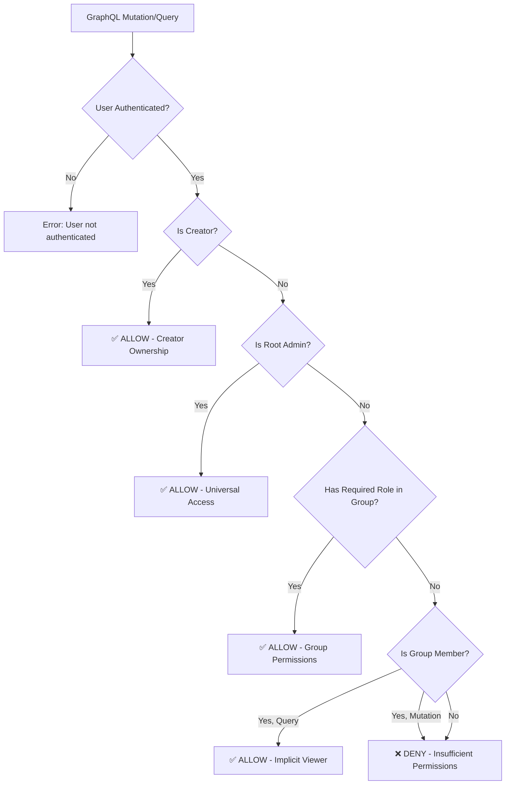

# Admission Application GraphQL Model - RBAC Documentation

**Last Updated:** 2026-01-09  
**Version:** 1.0  
**Author:** Development Team

---

## Table of Contents

1. [Overview](#overview)
2. [Unified RBAC System](#unified-rbac-system)
3. [Admission Application Model](#admission-application-model)
4. [Permission Levels](#permission-levels)
5. [Usage Examples](#usage-examples)
6. [Testing](#testing)
7. [Troubleshooting](#troubleshooting)

---

## Overview

The Admission Application system implements a **Unified RBAC (Role-Based Access Control)** system that combines three authorization strategies:

1. **Creator Ownership** - Users permanently own content they create
2. **Group-Based Permissions** - Role-based access through group membership
3. **Implicit Viewer Access** - Group members can view content even without explicit roles

This documentation covers the GraphQL API for managing admission applications with comprehensive access control.

---

## Unified RBAC System

### Core Philosophy: "If You Created It, You Can Manage It"

The RBAC system ensures that:
- ✅ Creators **never lose access** to their own work (even after role changes)
- ✅ Group admins can **manage all content** in their groups
- ✅ Group members can **always view** their group's content
- ✅ Hierarchical permissions: Parent group admins manage child group content
- ✅ Root admins have **universal access**

### Authorization Flow



### Role Categories

#### 1. System Roles (Technical RBAC)
- `administrátor` - Full system access
- `admin` - English variant of administrátor
- `editor` - Can create/modify content
- `viewer` - Read-only access
- `čtenář` - Czech variant of viewer
- `zpracovatel gdpr` - GDPR processor
- `Správce areálu` - Campus manager

#### 2. Academic Leadership Roles
- `rektor` - University president
- `prorektor` - Vice-rector
- `děkan` - Faculty leader
- `proděkan` - Vice-dean
- `vedoucí katedry` - Department head
- `vedoucí učitel` - Leading teacher

#### 3. Guarantee Roles (Academic Responsibility)
- `garant` - Program guarantor
- `garant (zástupce)` - Deputy guarantor
- `garant předmětu` - Subject guarantor
- `odpovědný řešitel` - Principal investigator

#### 4. Teaching Roles
- `přednášející` - Lecturer
- `cvičící` - Trainer/exercise instructor

### Permission Levels

| Operation | Required Roles | Can Creator Override? |
|-----------|---------------|----------------------|
| **CREATE** | EDITOR_ROLES (15 roles) | N/A (becomes creator) |
| **READ** | VIEWER_ROLES (all authenticated) | ✅ Yes, always |
| **UPDATE** | EDITOR_ROLES (15 roles) | ✅ Yes, always |
| **DELETE** | ADMIN_ROLES (5 roles only) | ✅ Yes, always |

**EDITOR_ROLES** (15 total):
```python
["editor", "administrátor", "admin", "rektor", "prorektor", "děkan", 
 "proděkan", "vedoucí katedry", "vedoucí učitel", "garant", 
 "garant (zástupce)", "garant předmětu", "odpovědný řešitel",
 "zpracovatel gdpr", "Správce areálu"]
```

**ADMIN_ROLES** (5 total):
```python
["administrátor", "admin", "rektor", "prorektor", "děkan"]
```

---

## Admission Application Model

### GraphQL Type Definition

```graphql
type AdmissionApplicationGQLModel {
  id: UUID!
  created: DateTime
  lastchange: DateTime
  createdby_id: UUID
  changedby_id: UUID
  rbacobject_id: UUID  # Group ownership for RBAC
  
  # Application data
  applicant_user_id: UUID
  street: String
  house_number: String
  city: String
  postal_code: String
  applied_date: DateTime
  
  # References
  process_id: UUID
  payment_id: UUID
  
  # Relations
  process: AdmissionProcessGQLModel
  payment: AdmissionPaymentGQLModel
}
```

### Key Fields for RBAC

- **`createdby_id`** - User who created the application (permanent ownership)
- **`rbacobject_id`** - Group ID that owns this application (auto-assigned on creation)
- **`changedby_id`** - Last user who modified the application

---

## Permission Levels

### 1. CREATE (Insert) Operation

**Required:** `EDITOR_ROLES` (15 roles)

**Behavior:**
- User must have one of the editor roles in a group
- System automatically assigns `rbacobject_id` from user's group
- User becomes the creator (`createdby_id` = user.id)

**Example Mutation:**
```graphql
mutation CreateApplication {
  admissionApplicationInsert(
    application: {
      applicantUserId: "user-uuid"
      street: "Main Street"
      houseNumber: "123"
      city: "Prague"
      postalCode: "11000"
      appliedDate: "2024-01-15T10:00:00"
    }
  ) {
    __typename
    ... on AdmissionApplicationGQLModel {
      id
      city
      rbacobjectId  # Auto-assigned from user's group
      createdbyId   # Set to current user
    }
    ... on AdmissionApplicationGQLModelInsertError {
      code
      location
    }
  }
}
```

**Success Response:**
```json
{
  "data": {
    "admissionApplicationInsert": {
      "__typename": "AdmissionApplicationGQLModel",
      "id": "abc-123-def-456",
      "city": "Prague",
      "rbacobjectId": "group-uuid-123",
      "createdbyId": "user-uuid"
    }
  }
}
```

**Error Response (No Permissions):**
```json
{
  "errors": [{
    "message": "Permission denied. User 'Miriam Jakšíková' (ID: xxx) cannot create this entity. Required roles: [editor, administrátor, admin, rektor, prorektor (and 10 more)]. Your current roles: [NONE]."
  }]
}
```

### 2. READ (Query) Operation

**Required:** Any authenticated user (implicit viewer access for group members)

**Behavior:**
- Users can read applications they created
- Users can read applications in groups where they have any role
- Root admins can read everything

**Example Query:**
```graphql
query GetApplication {
  admissionApplicationById(id: "abc-123-def-456") {
    id
    city
    street
    appliedDate
    process {
      name
    }
  }
}
```

**Page Query with Filtering:**
```graphql
query ListApplications {
  admissionApplicationPage(
    where: {
      city: { _eq: "Prague" }
    }
    limit: 10
    offset: 0
  ) {
    id
    city
    applicantUserId
  }
}
```

### 3. UPDATE Operation

**Required:** `EDITOR_ROLES` **OR** Creator Ownership

**Behavior:**
- ✅ Creator can **always** update (even if demoted to viewer)
- ✅ Users with editor role in the same group can update
- ✅ Root admins can update everything
- ❌ Viewers cannot update (unless they're the creator)

**Example Mutation:**
```graphql
mutation UpdateApplication {
  admissionApplicationUpdate(
    application: {
      id: "abc-123-def-456"
      lastchange: "2024-01-15T10:30:00"  # Required for optimistic locking
      city: "Brno"
      postalCode: "60200"
    }
  ) {
    __typename
    ... on AdmissionApplicationGQLModel {
      id
      city
      postalCode
      lastchange  # New timestamp
    }
    ... on AdmissionApplicationGQLModelUpdateError {
      code
      location
    }
  }
}
```

**Success Response:**
```json
{
  "data": {
    "admissionApplicationUpdate": {
      "__typename": "AdmissionApplicationGQLModel",
      "id": "abc-123-def-456",
      "city": "Brno",
      "postalCode": "60200",
      "lastchange": "2024-01-15T10:35:22.123456"
    }
  }
}
```

**Error Response (Permission Denied):**
```json
{
  "errors": [{
    "message": "Permission denied for Oliver Hortík. You must be the creator or have one of these roles [editor/administrátor/admin/rektor/prorektor (and 10 more)] in the entity's group."
  }]
}
```

### 4. DELETE Operation

**Required:** `ADMIN_ROLES` (5 roles) **OR** Creator Ownership

**Behavior:**
- ✅ Creator with admin role can delete their own applications
- ✅ Group admins can delete applications in their group
- ✅ Root admins can delete everything
- ❌ Editors cannot delete (even their own - need admin role)

**Example Mutation:**
```graphql
mutation DeleteApplication {
  admissionApplicationDelete(
    application: {
      id: "abc-123-def-456"
      lastchange: "2024-01-15T10:35:22.123456"
    }
  ) {
    __typename
    ... on AdmissionApplicationGQLModelDeleteError {
      code
      location
    }
  }
}
```

**Success Response:**
```json
{
  "data": {
    "admissionApplicationDelete": null  # Successful deletion returns null
  }
}
```

---

## Usage Examples

### Scenario 1: Complete Workflow with Creator Ownership

**Users:**
- **John Newbie** - Has `administrátor` role in "Univerzita obrany" group
- **Estera Lučková** - Has `editor` role in "Univerzita obrany" group
- **Oliver Hortík** - Has `viewer` role in "Univerzita obrany" group

**Step 1: John Creates an Application**
```graphql
mutation {
  admissionApplicationInsert(
    application: { city: "Prague", applicantUserId: "john-uuid" }
  ) {
    id  # Returns: "app-001"
    rbacobjectId  # Auto-assigned: "univerzita-uuid"
    createdbyId   # Set to: "john-uuid"
  }
}
```

**Step 2: Estera (Editor in Same Group) Can Update**
```graphql
mutation {
  admissionApplicationUpdate(
    application: { 
      id: "app-001"
      lastchange: "2024-01-15T10:00:00"
      city: "Brno" 
    }
  ) {
    id
    city  # Successfully updated to "Brno"
  }
}
```

**Step 3: Oliver (Viewer) Can Read but Not Update**
```graphql
# ✅ READ works
query {
  admissionApplicationById(id: "app-001") {
    id
    city  # Returns: "Brno"
  }
}

# ❌ UPDATE fails
mutation {
  admissionApplicationUpdate(
    application: { 
      id: "app-001"
      lastchange: "2024-01-15T11:00:00"
      city: "Ostrava" 
    }
  ) {
    # Error: "Permission denied for Oliver Hortík"
  }
}
```

**Step 4: John (Creator) Can Always Update, Even If Demoted**
```graphql
# Even if John's role changes to "viewer" later,
# he can STILL update because he created it
mutation {
  admissionApplicationUpdate(
    application: { 
      id: "app-001"
      lastchange: "2024-01-15T12:00:00"
      city: "Plzeň" 
    }
  ) {
    id
    city  # Successfully updated - creator ownership
  }
}
```

**Step 5: Only Admins Can Delete**
```graphql
# ✅ John (admin) can delete
mutation {
  admissionApplicationDelete(
    application: { 
      id: "app-001"
      lastchange: "2024-01-15T13:00:00"
    }
  ) {
    # Success - John has admin role
  }
}

# ❌ Estera (editor) cannot delete
mutation {
  admissionApplicationDelete(
    application: { 
      id: "app-002"
      lastchange: "2024-01-15T14:00:00"
    }
  ) {
    # Error: "Permission denied" - needs admin role
  }
}
```

### Scenario 2: Hierarchical Group Permissions

**Groups:**
- **Univerzita obrany** (parent)
  - **Fakulta ekonomiky a managementu** (child)
    - **Katedra informatiky** (grandchild)

**Users:**
- **Rector** - `administrátor` in "Univerzita obrany"
- **Dean** - `editor` in "Fakulta ekonomiky a managementu"
- **Department Head** - `editor` in "Katedra informatiky"

**Behavior:**
- Rector can manage applications in ALL three groups (hierarchical admin)
- Dean can manage applications in "Fakulta" and "Katedra" (hierarchical editor)
- Department Head can only manage applications in "Katedra"

---

## Testing

### Test Users from Demo Data

Use these real users for testing:

1. **john.newbie@world.com**
   - Role: `administrátor` in Univerzita obrany
   - Can: CREATE, READ, UPDATE, DELETE
   
2. **Oliver.Hortik@world.com**
   - Roles: `viewer` in Univerzita, `odpovědný řešitel` in řešitelský kolektiv
   - Can: CREATE (via odpovědný řešitel), READ, UPDATE own items
   
3. **Miriam.Jaksikova@world.com**
   - Roles: NONE
   - Can: Nothing (will get permission denied errors)

### Running Tests

```bash
# Run all RBAC tests
pytest tests/test_rbac_admission_application.py -v

# Run specific test
pytest tests/test_rbac_admission_application.py::test_admin_can_create_admission_application -v

# Run with output
pytest tests/test_rbac_admission_application.py -v -s
```

### Test Coverage

The test suite covers:
- ✅ Admins can create applications
- ✅ Users with `odpovědný řešitel` can create
- ✅ Users without roles cannot create
- ✅ Creators can update their own applications
- ✅ Same-group editors can update applications
- ✅ Viewers cannot update applications
- ✅ Admins can delete applications
- ✅ Non-admins cannot delete applications
- ✅ Users can read applications in their groups

---

## Troubleshooting

### Common Issues

#### 1. "User not authenticated"

**Problem:** User context not set properly

**Solution:**
```python
# Ensure user is in context
context = {
    "user": {
        "id": "user-uuid",
        "email": "user@example.com",
        "fullname": "User Name",
        "roles": [
            {
                "roletype": {"name": "editor"},
                "group": {"id": "group-uuid"}
            }
        ]
    }
}
```

#### 2. "Permission denied. Required roles: [...]"

**Problem:** User doesn't have required role in a group

**Solution:**
- Check user's roles: `roles` array must contain proper structure
- Verify role type name matches one of the required roles
- Ensure user has a `group.id` in their role
- For CREATE/UPDATE: Need `EDITOR_ROLES`
- For DELETE: Need `ADMIN_ROLES`

#### 3. "Cannot create entity. Your current roles: [NONE]"

**Problem:** User has no roles assigned

**Solution:**
- Assign at least one editor role to the user in the UG service
- Verify the role appears in the user context

#### 4. Auto-assignment fails on CREATE

**Problem:** User has multiple groups, wrong one selected

**Solution:**
- System selects "leaf" group (most specific)
- To override, explicitly set `rbacobjectId` in input:
```graphql
mutation {
  admissionApplicationInsert(
    application: {
      rbacobjectId: "specific-group-uuid"  # Override auto-selection
      city: "Prague"
    }
  ) { id }
}
```

#### 5. Update fails with optimistic locking error

**Problem:** `lastchange` timestamp mismatch

**Solution:**
- Always fetch current `lastchange` before updating
- Use the exact timestamp from the database
```graphql
# 1. Fetch current state
query {
  admissionApplicationById(id: "abc-123") {
    id
    lastchange  # Use this value
    city
  }
}

# 2. Update with correct lastchange
mutation {
  admissionApplicationUpdate(
    application: {
      id: "abc-123"
      lastchange: "2024-01-15T10:35:22.123456"  # From step 1
      city: "New City"
    }
  ) { id }
}
```

---

## Technical Architecture

### Extension Pipeline

**INSERT Operation:**
```
Request → PermissionFilterExtension → OwnershipPermissionExtension 
       → AutoGroupAssignmentExtension → Resolver
```

**UPDATE/DELETE Operation:**
```
Request → PermissionFilterExtension → OwnershipPermissionExtension 
       → RbacProviderExtension → LoadDataExtension → Resolver
```

### Key Components

1. **PermissionFilterExtension**
   - Filters internal kwargs before passing to resolver
   - Removes: `user_roles`, `rbacobject_id`, `db_row`

2. **OwnershipPermissionExtension**
   - Checks creator ownership OR group permissions
   - Implements the unified RBAC logic

3. **AutoGroupAssignmentExtension**
   - Auto-assigns `rbacobject_id` from user's group
   - Validates user has required roles

4. **RbacProviderExtension**
   - Extracts `rbacobject_id` from existing entity

5. **LoadDataExtension**
   - Batch loads existing entity by ID

---

## API Reference

### Queries

```graphql
type Query {
  admissionApplicationById(id: UUID!): AdmissionApplicationGQLModel
  admissionApplicationPage(
    where: AdmissionApplicationInputFilter
    limit: Int
    offset: Int
  ): [AdmissionApplicationGQLModel!]!
}
```

### Mutations

```graphql
type Mutation {
  admissionApplicationInsert(
    application: AdmissionApplicationInsertGQLModel!
  ): AdmissionApplicationGQLModel | AdmissionApplicationGQLModelInsertError!
  
  admissionApplicationUpdate(
    application: AdmissionApplicationUpdateGQLModel!
  ): AdmissionApplicationGQLModel | AdmissionApplicationGQLModelUpdateError!
  
  admissionApplicationDelete(
    application: AdmissionApplicationDeleteGQLModel!
  ): AdmissionApplicationGQLModelDeleteError
}
```

### Input Types

```graphql
input AdmissionApplicationInsertGQLModel {
  applicantUserId: UUID
  street: String
  houseNumber: String
  city: String
  postalCode: String
  appliedDate: DateTime
  processId: UUID
  paymentId: UUID
  rbacobjectId: UUID  # Optional - auto-assigned if not provided
}

input AdmissionApplicationUpdateGQLModel {
  id: UUID!
  lastchange: DateTime!  # Required for optimistic locking
  applicantUserId: UUID
  street: String
  houseNumber: String
  city: String
  postalCode: String
  appliedDate: DateTime
  processId: UUID
  paymentId: UUID
}

input AdmissionApplicationDeleteGQLModel {
  id: UUID!
  lastchange: DateTime!  # Required for optimistic locking
}
```

---

## Security Best Practices

1. **Always validate user authentication** before any operation
2. **Use optimistic locking** (`lastchange`) for concurrent updates
3. **Never expose sensitive data** without permission checks
4. **Log all permission denials** for security auditing
5. **Implement rate limiting** on mutations
6. **Use HTTPS** for all GraphQL endpoints
7. **Validate input data** before processing
8. **Audit creator ownership** changes (should be rare)

---

## Future Enhancements

- [ ] Add field-level permissions (e.g., only admins see sensitive fields)
- [ ] Implement time-based permissions (e.g., auto-revoke after date)
- [ ] Add delegation system (temporary permission grants)
- [ ] Support for permission inheritance customization
- [ ] GraphQL subscriptions for real-time permission changes
- [ ] Permission audit log viewer
- [ ] Bulk operations with RBAC

---

## References

- [Unified RBAC Extensions Source](./src/GraphTypeDefinitions/unified_rbac_extensions.py)
- [Admission Application GQL Model](./src/GraphTypeDefinitions/AdmissionApplicationGQLModel.py)
- [RBAC Tests](./tests/test_rbac_admission_application.py)
- [Strawberry GraphQL Documentation](https://strawberry.rocks/)

---

**Document Version:** 1.0  
**Last Updated:** 2026-01-09  
**Maintainer:** Development Team

